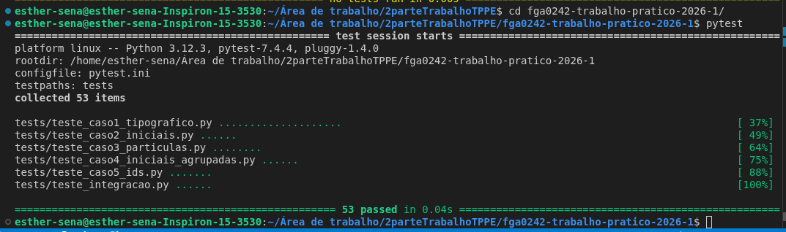

# Trabalho TPPE - Desduplicação de Autores

## Integrantes

- Esther Sena - 210162769
- José André - 211062016
- Erick Santos - 211061672
- Lucas Ribeiro - 211063185 
## Linguagem

Python

## Framework de Testes

[pytest](https://docs.pytest.org/) **8.1.1** (versão fixada em `requirements.txt`)

## Como executar

Instale as dependências:

```bash
pip install -r requirements.txt
```

Execute todos os testes:

```bash
pytest
```

Execute apenas os testes de um caso específico (categoria/marker, registrados em `pytest.ini`):

```bash
pytest -m caso1   # também: caso2, caso3, caso4, caso5, integracao
```

> A descoberta de testes está configurada em `pytest.ini` (`python_files = teste_*.py test_*.py`),
> pois os módulos de teste seguem o padrão `teste_*` (com "e"), diferente do padrão default do
> pytest (`test_*`). Sem essa configuração os testes não seriam coletados.

## Recursos do framework de testes utilizados

- **Suítes de teste**: cada caso possui seu próprio módulo em `tests/`, agrupando os cenários relacionados a uma mesma unidade.
- **Categorias de teste**: markers registrados em `pytest.ini` (`caso1`...`caso5`, `integracao`), permitindo filtrar a execução com `pytest -m <marker>`.
- **Testes parametrizados**: `@pytest.mark.parametrize`, alimentados pelos conjuntos de dados em `dados/*.json`, carregados via `tests/dados_loader.py::carregar_casos`.
- **Testes de exceção**: `pytest.raises`, para validar o comportamento das unidades diante de entradas inválidas.

## Estrutura do Projeto

```text
tppe-desduplicacao/
│
├── README.md
├── requirements.txt
├── pytest.ini
│
├── src/
│   ├── autor.py
│   ├── caso1_tipografico.py
│   ├── caso2_iniciais.py
│   ├── caso3_particulas.py
│   ├── caso4_iniciais_agrupadas.py
│   ├── caso5_ids.py
│   └── desduplicador.py
│
├── tests/
│   ├── dados_loader.py
│   ├── teste_caso1_tipografico.py
│   ├── teste_caso2_iniciais.py
│   ├── teste_caso3_particulas.py
│   ├── teste_caso4_iniciais_agrupadas.py
│   ├── teste_caso5_ids.py
│   └── teste_integracao.py
│
└── dados/
    ├── caso1.json
    ├── caso2.json
    ├── caso3.json
    ├── caso4.json
    └── caso5.json
```

## Convenção dos conjuntos de dados (`dados/*.json`)

Cada arquivo `dados/casoN.json` contém uma lista de cenários no formato:

```json
{
  "descricao": "explicação do cenário",
  "registros_originais": [{"id": "...", "nome": "..."}],
  "registros_esperados": [{"id": "...", "nome": "..."}]
}
```

`registros_originais` representa os dados de entrada (como recebidos de fontes diferentes) e
`registros_esperados` representa o resultado esperado após a deduplicação/curadoria, espelhando
as tabelas de antes/depois apresentadas no enunciado para cada caso. Use
`tests.dados_loader.carregar_casos("casoN.json")` para alimentar `@pytest.mark.parametrize`.

## Divisão da primeira parte

| Pessoa | Responsabilidade |
| --- | --- |
| Pessoa 1 | Caso 1: diferenças tipográficas, incluindo utilitários de normalização de caracteres e acentuação quando necessário. |
| Pessoa 2 | Casos 2 e 4: sobrenome com iniciais e iniciais agrupadas, mantendo consistência entre formas abreviadas parecidas. |
| Pessoa 3 | Caso 3: partículas como `de`, `da`, `do`, `dos` e pontuação opcional. |
| Pessoa 4 | Caso 5: unificação de IDs, além do `Desduplicador` e dos testes de integração do pipeline completo. |

## Divisão da segunda parte - Refatorações

| Operação | Alvo |
| --- | --- |
| **Extrair Método** | `ResolvedorTipográfico::resolver()` |
| **Substituir Método por Objeto-Método** | `ResolvedorParticulas::resolver()` |
| **Extrair Classe** | classe relacionada a IDs de resolução |

### Responsabilidades por pessoa nas refatorações

**Pessoa 1 - Extrair Método em `ResolvedorTipográfico::resolver()`**

Analisar o método `resolver()` e identificar trechos coesos que podem virar métodos menores
com nomes expressivos, como normalizar acentos, tratar apóstrofo e comparar grafias.
Commit esperado: `[Refact] Extrair Método, ResolvedorTipográfico::resolver()`.

**Pessoa 2 - Substituir Método por Objeto-Método em `ResolvedorParticulas::resolver()`**

Criar uma nova classe cujo construtor recebe os parâmetros do método original, transformando
os passos do método em métodos dessa classe. Essa é a operação mais delicada e exige atenção
para não quebrar os testes existentes. Commit esperado:
`[Refact] Substituir Método por Objeto Método, ResolvedorParticulas::resolver()`.

**Pessoa 3 - Extrair Classe para IDs de resolução**

Identificar responsabilidades sobre resolução de IDs que estejam espalhadas no código e movê-las
para uma classe dedicada, com responsabilidade única. Commit esperado:
`[Refact] Extrair Classe, <nome da classe criada>`.

**Pessoa 4 - Testes, Integração e Revisão geral**

Garantir que todos os testes continuam passando após cada refatoração, verificar se as mensagens
de commit seguem o formato `[Refact] <operação>, <Classe / Método alvo>` e atualizar o README
quando necessário. Também atua como revisora dos PRs das outras pessoas antes do merge.

A ordem natural de execução das refatorações é Pessoa 1, Pessoa 3 e Pessoa 2. Como as mudanças
ocorrem em classes diferentes, elas podem avançar em paralelo desde que a Pessoa 4 rode os testes
completos ao final.

## Fluxo TDD

1. Criar a branch do caso.
2. Escrever os testes no arquivo correspondente em `tests/`.
3. Implementar a menor solução possível no arquivo correspondente em `src/`.
4. Rodar `pytest`.
5. Abrir Pull Request para revisão.

## Registro da Pessoa 4 - Testes, Integração e Revisão

Eu Esther Sena atuei como responsável por validar a integração do projeto depois das refatorações,
garantindo que a suíte completa continue passando antes do merge.

- Testes executados: `pytest`
- Resultado da validação: 53 testes passando
- Escopo revisado: testes de unidade dos casos 1 a 5 e testes de integração do pipeline completo
- Convenção de commits verificada para refatorações: `[Refact] <operação>, <Classe / Método alvo>`
- Itens de revisão: funcionamento da integração, README e mensagens de commit relacionadas às refatorações

Evidência da execução da suíte completa:


